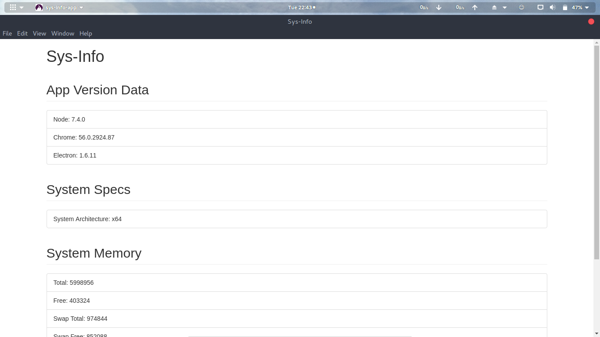

# Details
  This is a desktop App created using electron which displays system information.

# Installation
 
 * Clone this repo
 * Run `sudo npm install` in terminal
 * Run `sudo npm start`
 * Sys-info window will open 
 * Thanks For Trying this out!!

# Screens
 

